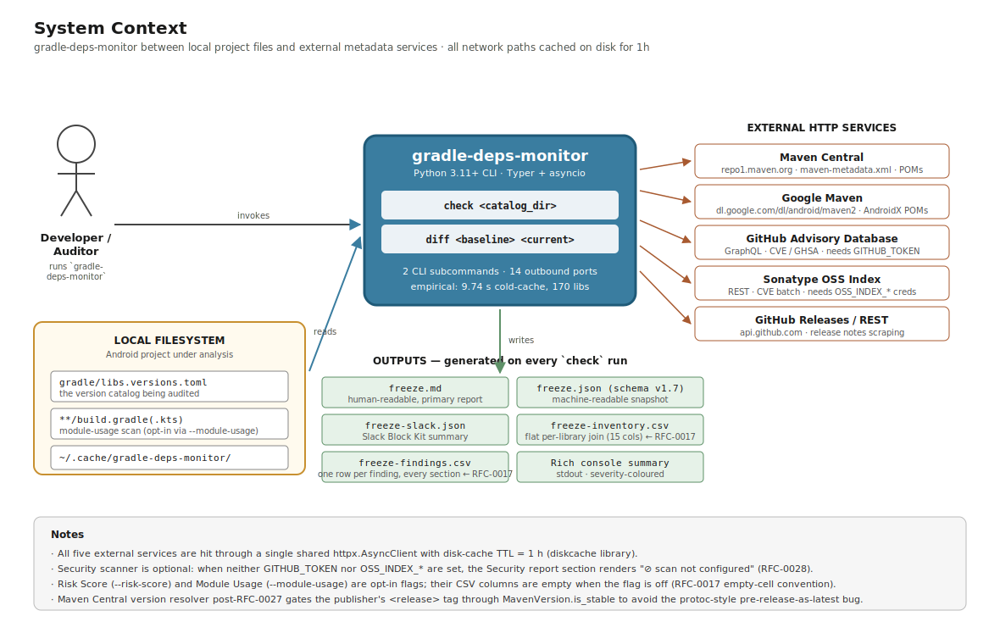

# gradle-deps-monitor

Freeze-time technical due-diligence for Android `libs.versions.toml` catalogs.
One CLI run audits every pinned dependency — version drift, CVEs, Play Store
compliance, toolchain compatibility, abandonment, licenses — and writes
structured reports (Markdown, JSON, CSV, Slack) ready to commit or post from CI.

> Single Python CLI. No wrapper scripts. Read-only against your repo.

## Install

```bash
pip install gradle-deps-monitor
```

Requires Python 3.11+. For local development:

```bash
git clone https://github.com/gustavo-pedreros/experiment-toml-deps-checker.git
cd experiment-toml-deps-checker
pip install -e ".[dev]"
```

## Quick start

```bash
gradle-deps-monitor check /path/to/gradle --out freeze-reports/$(date +%Y-%m-%d)
```

`/path/to/gradle` is the directory containing `libs.versions.toml`. Reports
default to `./reports/`.

```
╭─ Gradle Dependency Freeze Report ─╮
│ Generated  2026-05-04T10:00:00    │
│ Libraries  42                     │
│ Plugins    6                      │
╰───────────────────────────────────╯

Outdated (3)         2 major  1 minor  0 patch
Catalog Health       ✅ no findings
Security             ⊘ scan not configured — set GITHUB_TOKEN
Play Store           ❗ 1 violation
                       PLAY-DEP-001  SafetyNet → Play Integrity

Reports written → freeze-reports/2026-05-04
  • freeze.md  • freeze.json  • freeze-slack.json
  • freeze-inventory.csv  • freeze-findings.csv
```

## What it checks

| Dimension | What runs |
|---|---|
| **Version drift** | Latest stable from Maven Central / Google Maven, classified `patch` / `minor` / `major`. Pre-1.0 versions tracked separately. |
| **Catalog health** | 9 rules: duplicates, unresolved `version.ref`, orphan keys, naming consistency, BoM children, etc. |
| **CVEs** | GitHub Advisory DB + Sonatype OSS Index. Requires credentials — see [Credentials](#credentials). |
| **Play Store compliance** | Deprecated libraries (SafetyNet, Play Core Splitcompat…) and `targetSdk` against Google's current minimum. |
| **Toolchain** | Kotlin ↔ Compose Compiler, Kotlin ↔ KSP, AGP ↔ Gradle wrapper. |
| **Library health** | Curated KB (26 entries) + Maven POM `<relocation>` + inactivity heuristic (`<lastUpdated>`). |
| **BoM resolution** | Detects `*-bom` / `*-platform` artefacts, fetches `<dependencyManagement>`, enriches catalog children. |
| **Licenses** | POM `<licenses>` classified Permissive / Weak / Strong copyleft / Unknown. |
| **Changelog scrape** | GitHub Releases / `CHANGELOG.md` for major upgrades, with a breaking-change heuristic (🔴 / 🟢 / ⚪). |
| **Module usage map** *(opt-in)* | Static scan of `build.gradle(.kts)` files; counts `implementation` / `api` / test usage per library. |
| **Risk score** *(opt-in)* | Composite 0-100 per library across 6 weighted dimensions (experimental). |

Opt-in flags:

```bash
gradle-deps-monitor check gradle --module-usage --risk-score
```

## Commands

```bash
gradle-deps-monitor check <gradle-dir> [--out DIR] [--module-usage] [--risk-score]
gradle-deps-monitor diff  <current.json> [--prev <previous.json>] [--out DIR]
```

`diff` compares two `freeze.json` reports. Run without `--prev` to register a
baseline on first use.

## Outputs

| Command | File | Format |
|---|---|---|
| `check` | `freeze.md` | Markdown — commit alongside the catalog |
| `check` | `freeze.json` | JSON — `schema_version` 1.x (SemVer, additive MINOR) |
| `check` | `freeze-slack.json` | Slack Block Kit — POST to an incoming webhook |
| `check` | `freeze-inventory.csv` | 15-column per-library snapshot for spreadsheets / BI |
| `check` | `freeze-findings.csv` | Per-finding rows across every section |
| `diff` | `freeze-diff.md` / `.json` / `-slack.json` | Same triad, comparing two freezes |

JSON schema is versioned per [ADR-0008](docs/adr/0008-json-schema-semver.md):
consumers reading `1.x` MUST tolerate unknown fields and unknown enum values.

## Credentials

| Variable | Required for |
|---|---|
| `GITHUB_TOKEN` (or `GH_TOKEN`) | CVE scan via GitHub Advisory DB; raises the changelog rate limit. **Zero scopes** suffice — used for rate-limit only. |
| `OSSINDEX_USER` + `OSSINDEX_API_KEY` | CVE scan via Sonatype OSS Index. |

Without credentials, the Security section renders an `⊘ scan not configured`
placeholder and the CVE dimension of the risk score is zero.

## Configuration

Drop a `gradle-deps-monitor.toml` next to your Gradle directory to override
risk-score weights, thresholds, and cache behaviour. Every section is optional.

```toml
[risk_weights]      # must sum to 100
outdatedness = 20
cve          = 40
abandonment  = 15
blast_radius = 10
compliance   = 10
license      = 5

[risk_thresholds]   # medium ≤ high ≤ critical
critical = 80
high     = 60
medium   = 40

[cache]             # all keys optional
root                 = "~/.cache/gradle-deps-monitor"
ttl_seconds_maven    = 3600         # Maven Central + Google Maven metadata
ttl_seconds_advisory = 86400        # GitHub Advisory DB + OSS Index
```

Resolution order: built-in defaults → `gradle-deps-monitor.toml` →
environment variables → CLI flags ([RFC-0012](docs/proposals/0012-layered-configuration.md)).

## Cache

HTTP responses (Maven metadata, advisory queries) are cached on disk per the
TTLs above. Three CLI flags adjust behaviour per run, and one env var
relocates the cache root:

| Knob | Effect |
|---|---|
| `--no-cache` | Bypass the persistent cache for this run. Adapters write to a tempdir cleaned up at exit; the persistent cache is left untouched. |
| `--clear-cache` | Purge the persistent cache before the run. Adapters rebuild from fresh HTTP. |
| `--cache-ttl SECONDS` | Override every adapter's TTL for this run. |
| `GRADLE_DEPS_MONITOR_CACHE_ROOT` *(env)* | Override the cache root. Useful for CI runners with read-only `$HOME` or nix-style isolation. |

## Architecture



The CLI sits between local Gradle inputs, external public registries, and the
files it writes. Implementation follows
[ADR-0006 (Pragmatic Clean Architecture)](docs/adr/0006-pragmatic-clean-architecture.md);
the six layers and import rules are enforced by `import-linter` in
`pyproject.toml`. Three more zoom levels — layer dependencies, the
`asyncio.gather` use-case pipeline, and the port↔adapter map — live in
[`docs/diagrams/`](docs/diagrams/).

## Documentation

- [Roadmap](docs/roadmap.md) — phases, shipped features, backlog
- [ADRs](docs/adr/) — architectural decisions (clean architecture, schema versioning, …)
- [RFCs](docs/proposals/) — design proposals per feature
- [Diagrams](docs/diagrams/) — four-zoom-level architecture overview
- [Contributing](docs/CONTRIBUTING-AI.md) — AI-assisted development workflow

## Development

```bash
ruff check . && ruff format --check . && mypy src/ && lint-imports && pytest
```

## License

MIT — see [LICENSE](LICENSE).

## Acknowledgements

Started from an early prototype by [Paul Ayala](https://github.com/pfranccino)
that proved the concept; current architecture is a full rewrite.
